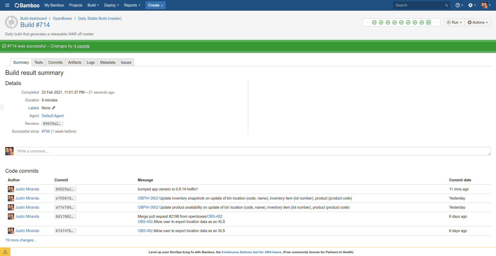
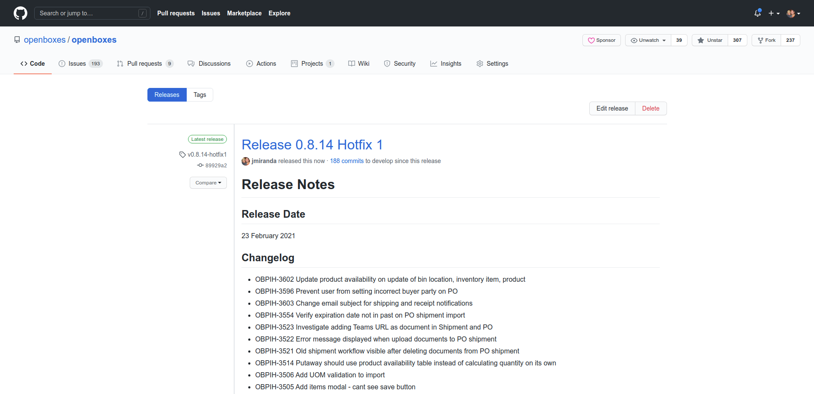

# Release Process
Created Thursday 21 March 2019
Updated Tuesday 23 February 2021

## Overview
* Create JIRA version 
* Create release branch
* Deploy to staging server 
* QA Process
* Finalize Release

### Create JIRA version
This step usually occurs before development has begun on a new release as the version number 
`fixVersion` is usually attached to a ticket to let us know under what release that ticket should be 
included. However, if you haven't created a new JIRA version by the time you're ready to release 
here's one way to do it. 

To create a version in JIRA:

1. Go to the OpenBoxes PIH project
1. Click on Releases
1. Click on Create Version
1. Enter version number, start date, end date, and comment
1. Click Save

You can also create a release from the Kanban board (when releasing closed tickets) or in the 
Agile (Scrum) board (see Epics and Versions sidebar).
 
### Create release branch
Once you have completed all of the tickets for the new version (which could take several sprints) 
and you have merged all pull requests (PRs) for these tickets, you're ready to create a release 
branch. This branch acts as a container for all changes that should be released for this version
as well as any last minute bug fixes that need to be made before the release is finalized.

1. First of all, you'll need to checkout the develop branch and make sure you have all of the latest
changes.

        git checkout develop
        git pull --rebase

1. Create new release branch off develop

        git checkout -b release/x.y.z
        git push --set-upstream origin release/x.y.z

1. Change version number in application.properties

        app.version=x.y.z

1. Commit version change

        git commit -am "bumped app version to x.y.z"

### Change release branch on Bamboo

1. Go to Linked Repositories
1. Select openboxes-release
1. Change the Branch to release/x.y.z

Bamboo should automatically trigger a build for OBNAVSTAGE, but if that doesn't happen within a 
few minutes just go to the build plan page and trigger it manually.
<http://bamboo.pih-emr.org:8085/browse/OPENBOXES-SDONS>

### Testing Release
Once the latest release branch has been deployed to OBNAVSTAGE we can start the QA pass. During 
this process we might add a few Bug tickets, but there should be no new features. Developers 
should either create branches off of release/x.y.z or commit directly to the release branch.

### Finalize Release
Finalizing the release involves making the following changes to JIRA and Github.

Once the QA pass has been completed and there are no more bugs, we can start to finalize the 
release. 

#### JIRA

1. Close any tickets that have been completed
1. Move remaining tickets to the next sprint / backlog
1. Remove fixVersion for any open tickets with fixVersion = x.y.z 
1. Go to Versions page
1. Generate Release Notes (text) for version x.y.z

#### GitHub

1. Create a Release on GitHub (include Release Notes from JIRA)

    

1. Merge release branch into master

        git checkout master
        git merge release/x.y.z

1. Bump app version (remove -SNAPSHOT)

        git add application.properties
        git commit -m "bumped app version to x.y.z"
        
1. Tag release ([See Tagging section](http://docs.openboxes.com/en/latest/developer-guide/tagging/))
   
        git tag -a vx.y.z -m 'Release x.y.z' 
        git push --tags

1. Push master to remote

        git push

### Deployment

1. Run Daily Stable Build plan (automated)

    
   

1. Download the Latest WAR artifact from Daily Stable Build > Artifacts

    

### Publish Release Notes 

1. Upload WAR to release 

    

1. Publish Release Notes to openboxes.com

    

### Cleanup

1. On Bamboo, change openboxes-release back to master 
   
    

1. Merge master into develop

        git checkout develop
        git merge master
        # fix conflicts
        git push
        
1. Bump version (if major/minor release)

        # bump version number in application.properties
        git add application.properties
        git commit -m "bumped app version to x.y.z+1-SNAPSHOT"
        git push

1. Delete release/x.y.z branch

        git branch -d release/x.y.z

## Resources
* <https://semver.org/>
* <https://www.atlassian.com/git/tutorials/comparing-workflows/gitflow-workflow>
* <https://gitversion.readthedocs.io/en/latest/git-branching-strategies/gitflow-examples/>
* <https://gitversion.readthedocs.io/en/latest/git-branching-strategies/gitflow/>
* <https://danielkummer.github.io/git-flow-cheatsheet/>
* <https://medium.com/hard-work/gitflow-release-hotfix-bddee96fc5c3>
* <https://www.fredonism.com/a-practical-take-on-gitflow-and-semantic-versioning>

