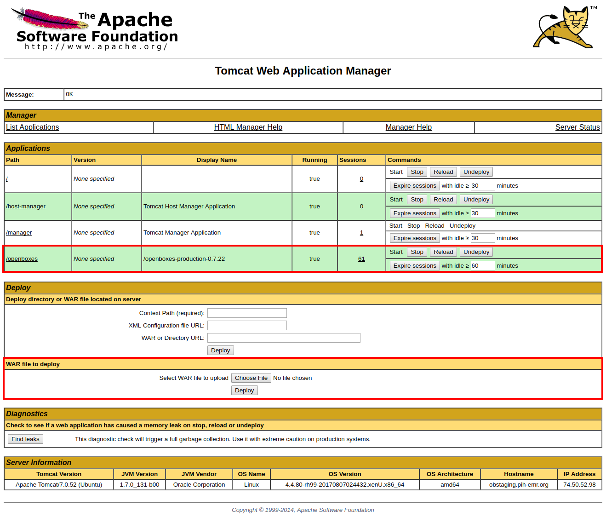

# Upgrading 

## Ubuntu Command Line
1. SSH into your server
1. Download WAR file from [latest release](https://github.com/openboxes/openboxes/releases/latest) page on GitHub
```
wget https://github.com/openboxes/openboxes/releases/download/<release-tag>/openboxes.war
```
1. Shutdown tomcat 
1. Remove existing deployment
```
sudo rm -rf /var/lib/tomcat7/webapps/openboxes*
```
1. Copy WAR file to Tomcat webapps directory (NOTE: we need to change the name of the WAR file)
```
sudo cp openboxes-0.7.22.war /var/lib/tomcat7/webapps/openboxes.war
```
1. Start Tomcat (NOTE: this may take awhile if there are lots of data migrations)
1. Check the logs 
```
sudo tail -f /var/logs/tomcat7/catalina.out
```


## Tomcat Manager
This is the easiest way to upgrade, but you need to make sure you 
1. Install Tomcat manager
```
sudo apt-get install tomcat-manager
```
1. Add a new user in /usr/share/tomcat7/conf/tomcat-users.xml
```
<user username="<username>" password="<password>" roles="manager-gui"/>
```
1. Restart Tomcat
1. Download WAR file from [latest release](https://github.com/openboxes/openboxes/releases/latest) page on GitHub
```
wget https://github.com/openboxes/openboxes/releases/download/<release-tag>/openboxes.war
```
1. Log into Tomcat Manager (using username/password from Step 2)
1. Upload WAR file to Tomcat Manager

1. Restart Tomcat from the command line (optional, but hightly recommended)
